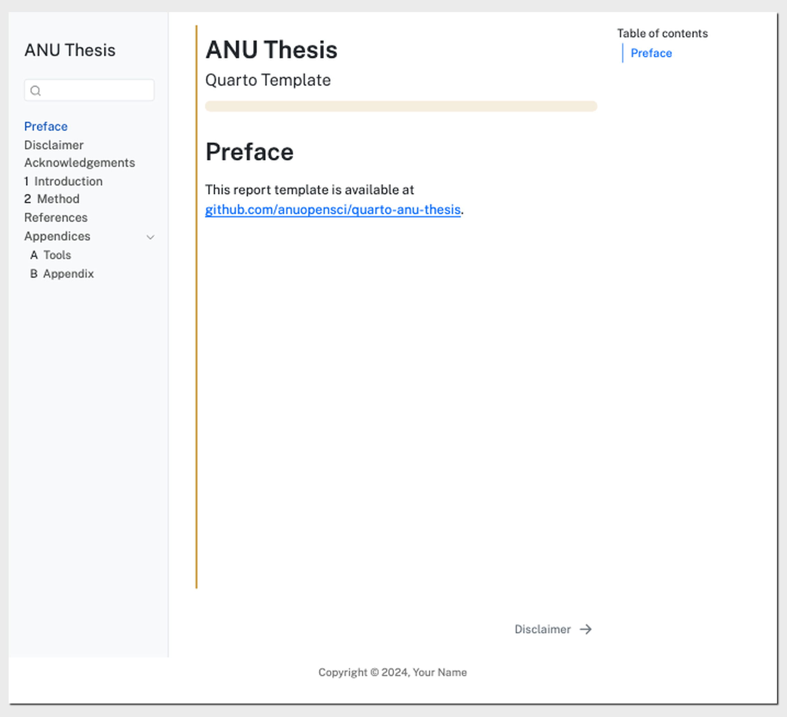
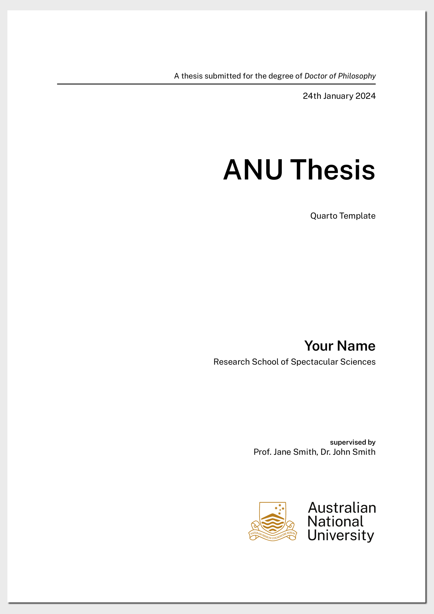

<!-- README.md is generated from README.qmd. Please edit that file -->

# Quarto template for ANU Thesis

This repository contains the Quarto template for ANU thesis.

***Work-in-Progress***

## Getting started

To use this template, either **click on the “use this template” button
on the top right corner** or download it. You can also fork the
repository but it copies the entire git history of the repository, which
is only necessary for those wishing to contribute to the template.

After making your own copy, you should change the parameters in the
`_quarto.yml` file to reflect your own thesis.

## Format Options

This template outputs both the html and pdf version of the thesis. You
can choose to render only one of them by commenting out the `format`
option you don’t want in the `_quarto.yml` file.

### HTML output

### PDF output

