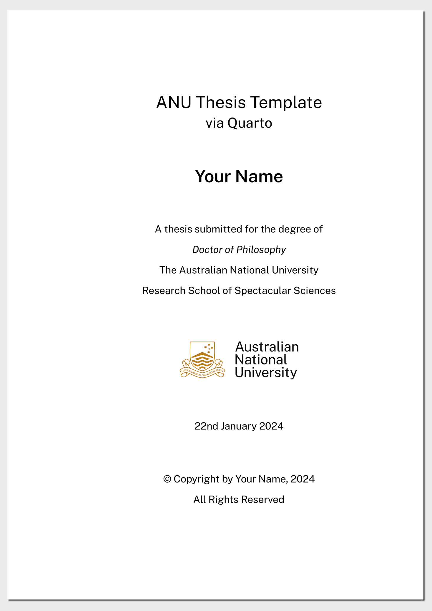

<!-- README.md is generated from README.qmd. Please edit that file -->

# Quarto template for ANU Thesis

This repository contains the Quarto template for ANU thesis.

***Work-in-Progress***

## Getting started

1.  Install [Quarto](https://quarto.org/docs/get-started/).
2.  You may need to install Public Sans font if you do not have it. You
    can find it
    [here](https://github.com/anuopensci/quarto-anu-report/tree/main/_extensions/anu-report/assets/webfonts).
3.  The easiest way to edit and render the document is using the
    [RStudio IDE](https://posit.co/download/rstudio-desktop/). If you
    prefer not to install R, then you can use VS Code instead.
4.  From the Terminal run the following command

``` bash
quarto use template anuopensci/quarto-anu-thesis
```

This will install the extension and create an example qmd file that you
can use as a starting place for your report.

## Format Options

There are three formats available: pdf and html.

### `anu-thesis-pdf`

[](examples/template.pdf)
